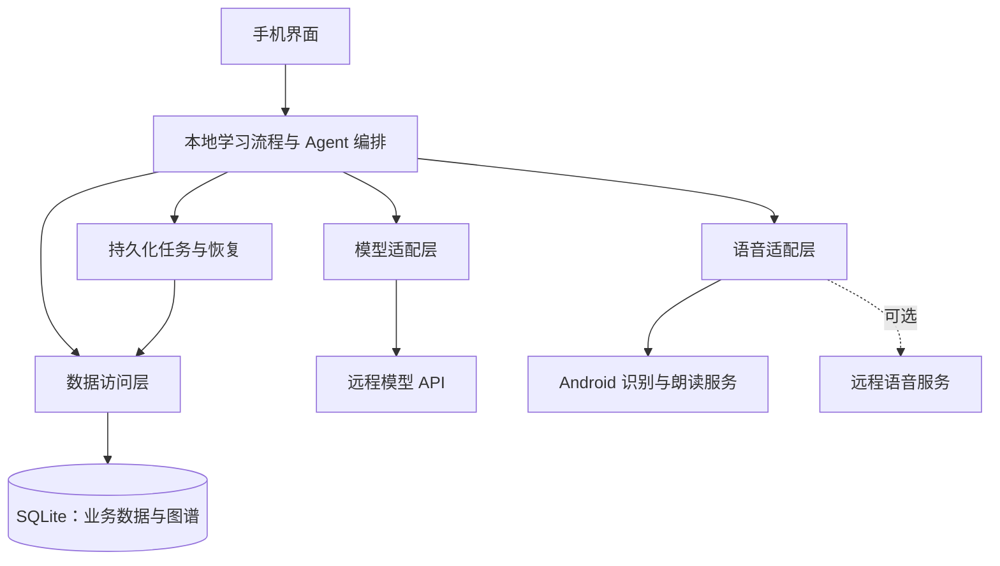

# Trellis 手机端重构说明

本文用于新建手机端仓库后的开发交接，可复制到新仓库的 `docs/mobile-rebuild-guide.md`。内容基于现有 Trellis Web 项目和本次架构讨论；它是手机端设计基线，不代表下述能力已经实现。

## 1. 产品目标与已确定方向

将 Trellis 做成安装即可使用的英语学习 App：用户与 AI 对话，App 自动沉淀生词和错因，并根据学习记录安排后续复习。

已确定的方向：

- 手机端使用独立仓库，建议名称为 `trellis-mobile`；保留现有 Web 仓库。
- 优先面向 Android，是否扩展 iOS 后续决定。
- 界面、业务逻辑、Agent 编排和学习数据全部集成在 App 内。
- 使用 SQLite 保存业务数据与图谱关系，不要求用户部署 PostgreSQL、Neo4j 或 Python 服务。
- 大模型继续使用远程 API，不将端侧大模型推理列入本次重构。
- Android 系统语音识别和朗读作为优先接入方案，实际可用性由设备和语言资源决定。

核心闭环：

> 对话或语音输入 → AI 回应与纠错 → 抽取知识 → 本地记录 → 针对性复习 → 更新学习状态。

“本地保存”不等于“数据不出设备”：调用远程大模型时，会发送本次任务需要的文本和上下文；使用联网语音引擎或远程转写时，音频也可能离开设备。

## 2. 实施默认方案与范围

以下是建议的实施默认值，可在新仓库初始化时调整，不视为用户已经确定的技术选型。

| 项目 | 建议默认值 | 原因 |
|---|---|---|
| 手机框架 | React Native + TypeScript + Expo development build | 延续 React/TypeScript 技术背景，并可接入原生模块 |
| 本地业务层 | 普通 TypeScript 模块与显式任务状态机 | 当前流程可直接表达，首版无需迁移 Python/LangGraph 运行时 |
| 数据访问 | Repository 接口 + SQLite 实现 | 隔离查询细节，方便迁移和测试 |
| 模型配置 | 用户配置服务地址、模型与自己的 Key | 首版无需自建模型代理和计费服务 |
| 用户形态 | 本机单用户，无强制登录 | 与本地优先的使用方式一致 |
| 语音 | 系统能力优先，远程服务作为可选扩展 | 先验证目标设备，再决定兜底范围 |

如果明确长期只支持 Android，也可以选择 Kotlin + Jetpack Compose；这会改变界面和业务层的实现语言，但不改变本文的数据模型和学习流程。

React Native 路线不能直接复用现有 DOM 页面、CSS、浏览器录音和 localStorage。可复用的是业务含义、部分纯 TypeScript 类型、提示词和交互设计。涉及自定义语音模块时使用原生开发构建，不以 Expo Go 作为全部能力的验收环境。

首版必须具备：模型配置、文字对话、会话恢复、知识抽取、生词和错因记录、每日练习、学习状态更新、系统语音能力检测与接入、数据导出恢复。

首版不包含：自建账户系统、跨设备同步、支付、社交、长时间实时语音通话、专业发音评分、复杂图算法和完整图谱可视化。图谱存储与关联查询仍属于首版基础能力。

## 3. 应用架构



App 内部通过函数和事件交互，不启动 FastAPI/uvicorn，也不通过 localhost HTTP 调用自身。SQLite 是学习状态的事实来源，页面状态只负责呈现。

建议目录，具体路由目录随所选框架调整：

```text
src/
  screens/                  页面
  components/               通用界面组件
  domain/                   学习实体、掌握度规则、复习规则
  application/              对话、抽取、出题、答题等用例
  repositories/             数据访问接口
  infrastructure/
    database/               SQLite 连接、迁移、Repository 实现
    models/                 远程模型适配器
    speech/                 系统与远程语音适配器
    secure-storage/         密钥存储
  tasks/                    持久化任务、重试与恢复
  prompts/                  提示词与版本
  contracts/                模型输出校验结构
modules/                    必要的原生语音桥接
docs/                       设计与开发说明
```

## 4. SQLite 与本地图谱

现有图谱查询主要是固定关系查询、排序和状态更新，可改写为 SQL。首版使用业务表与关系表，保留知识图谱语义，无需嵌入第二个数据库引擎。

建议的逻辑表如下，建表时再细化字段、外键和索引：

| 表 | 主要内容 |
|---|---|
| `profiles` | 本地学习者 ID、目标、水平 |
| `sessions` / `messages` | 会话、消息、角色、完成或中断状态 |
| `words` | 单词、词性、释义；需要时进一步区分词义 |
| `grammar_points` | 语法知识点 |
| `word_relations` | 起点、终点、同义/反义/搭配类型、来源 |
| `mistakes` | 原句、改句、错误类型、解释、来源消息 |
| `mistake_grammar_links` | 错误与语法点的关联 |
| `word_evidence` | 单词出现或学习的来源消息、抽取项标识 |
| `word_mastery` / `grammar_mastery` | 学习状态、证据统计、复习时间 |
| `daily_plans` / `daily_plan_items` | 当日计划、题目顺序、计划版本 |
| `exercises` | 题干、参考答案、目标知识点、题型 |
| `review_attempts` | 作答、评价状态、反馈、学习状态更新记录 |
| `tasks` | 抽取、出题、评价等任务及重试状态 |
| `settings` | 非敏感配置 |

数据约束：

- 持久化实体使用稳定 ID；每条纠错和生词证据能追溯到原始消息。
- 区分“单词已经存在”和“用户再次遇到该词”，重复出现可以增加证据，但不能重复创建词条。
- 对同一任务的重试按任务 ID、来源消息和已校验结果项去重；不同消息中的重复错误保留为不同证据。
- 图谱关联、学习事件、掌握度更新及任务完成标记尽可能在同一事务提交。
- `word_relations` 为关系起点和终点分别建索引，并约束重复边；对称关系采用统一存储规则。
- 使用外键与版本化迁移；掌握度、日期、关系端点等高频字段不要全部藏在 JSON 中。
- 多层关联查询可用递归 SQL，但必须限制深度并处理环；图谱界面按需加载局部子图。
- 单词/语法的权威关系保留来源和版本，优先来自可追溯词典数据；模型推测关系不能直接当作权威知识导入。

## 5. 远程模型与学习流程

### 5.1 模型适配层

对业务层提供统一能力，例如流式对话、结构化抽取、出题和开放式答案评价。第一版优先适配一个明确支持的服务协议，不能假设所有“兼容接口”的行为完全一致。

适配层负责超时、取消、错误分类、结构化结果解析和上下文长度控制。流式响应必须正确处理跨数据块的字符和事件边界，并在真机验证所选网络实现。

提示词与输出结构单独版本化；结果必须经过运行时校验，不能直接信任模型返回的 JSON。

### 5.2 一轮对话

1. 先将用户输入和待处理状态保存到本地。
2. 查询相关薄弱点、学习目标和有限的历史消息，实际加入模型上下文。
3. 调用远程模型，展示流式回复并保存回复状态；中断的回复标记为中断，不伪装成完整结果。
4. 将知识抽取任务持久化，以用户消息 ID 关联来源。
5. 校验抽取结果，保存有效结构化结果，再通过事务提交学习证据与状态。
6. 更新当前页面和后续复习安排；抽取失败不会撤销已完成的对话。

单词被提到不代表用户不认识。抽取策略应结合已有词汇状态、用户主动查询和上下文证据，允许用户移除误收录词条与错误分析。

### 5.3 每日练习

- 复习目标在本地根据到期时间、薄弱程度和近期学习记录选取。
- 生成后的题目在当天复用，重新打开页面不重复付费出题。
- “重新生成”创建新的计划版本，已完成题目及历史作答继续保留。
- 有确定答案的客观题在本地判分；开放式表达交给模型评价。
- 模型返回正确性和反馈，本地规则决定掌握度变化；旧提示词中的 `mastery_delta` 需要调整，不直接沿用为可信指令。
- 一次作答只更新一次学习状态；评价失败保持待评价，不计成答错。
- 首版采用明确、可测试的简单复习规则；FSRS 可以后续引入，提前保存时间戳与评价记录。

“今天”按设备当前时区计算；计划保存创建时的本地日期与时区，避免只按 UTC 日期分组。时区变化后不追溯修改已有练习历史。

## 6. Android 语音能力

### 6.1 语音转文字

使用 `SpeechRecognizer`，先检测识别服务、麦克风权限与目标语言支持。

- Android 12 / API 31 起，可用 `isOnDeviceRecognitionAvailable()` 检测端侧识别服务，并通过 `createOnDeviceSpeechRecognizer()` 创建端侧识别器。
- 服务存在不代表英语资源已就绪；较新系统可结合 `checkRecognitionSupport()` 等接口检测，按版本处理兼容路径。
- 普通系统识别可能联网；`EXTRA_PREFER_OFFLINE` 可能被实现忽略，不能作为离线保证。
- 首版采用单轮录音识别；不承诺全天持续监听或长时间实时通话。
- 不可用时保留文字输入，并提供明确的资源安装提示或用户选择的远程识别入口。

### 6.2 文字转语音

使用 `TextToSpeech`，等待初始化完成后检查英语支持和可用声音，支持朗读、停止与语速设置。

- 根据 `Voice.isNetworkConnectionRequired()` 区分需要网络的声音。
- 缺少语音资源时提供可理解的提示，不把失败表现为空白或无响应。
- 开始识别前停止 AI 朗读，减少把自身播放内容识别成用户输入的情况。
- 处理页面退出、权限撤销、耳机切换等生命周期与音频状态。

系统识别置信度不等于发音准确度，首版不据此输出发音分数。不同设备的引擎与语音质量存在差异，必须用目标用户实际设备验证。

## 7. 断网、退出与数据恢复

| 场景 | 预期行为 |
|---|---|
| 无网络 | 查看已保存会话、生词、错因，完成已有客观题；系统离线语音按设备能力使用 |
| 模型请求失败 | 保留输入和任务状态，提供重试，不生成伪成功反馈 |
| 流式回复中断 | 保留部分回复并明确标记；重试建立清晰的关联，不重复插入用户输入 |
| 抽取或评价期间退出 | 下次启动恢复持久化任务，已提交结果不重复入账 |
| 同一题重复点击提交 | 按作答 ID 去重，避免重复改变掌握度 |
| 系统语音不可用 | 文字功能正常，提示可选替代方案 |

任务可采用 `pending / running / succeeded / failed / cancelled` 状态。重启后识别遗留的 `running` 任务，恢复或提示重试；重试有次数和退避限制。取消与“请求是否已在远端计费”分别处理。

不能保证 App 退出后继续完成模型调用。自动重试也可能产生额外模型费用，本地幂等只能保证结果不重复入库，不能保证远端不重复计费。

提供带格式版本的数据导出与恢复，首版可采用逻辑数据包。导出不包含模型 Key；导入前校验结构与版本，并采用可回滚的恢复流程。若直接备份 SQLite 文件，必须使用一致性备份方式，不能随意复制正在写入的主数据库文件。

Key 使用系统安全存储，避免写入普通设置表、日志或导出文件。应用内置共享服务密钥不是可行的额度方案；若后续统一提供模型额度，再增加轻量网关管理授权和计费。

## 8. 现有项目迁移映射

下列路径均相对于旧 Trellis 仓库。新仓库交接时应附上旧仓库地址或源码，以及实际迁移基线的 commit ID。

| 现有位置 | 手机端处理 |
|---|---|
| `frontend/src/pages/` | 参考交互与信息结构，重写为手机界面 |
| `frontend/src/api.ts` | 参考类型，改成调用本地用例；模型网络请求集中到适配层 |
| `backend/app/agent/service.py` | 迁移对话编排与知识抽取流程 |
| `backend/app/agent/nodes.py` / `tools.py` | 迁移业务规则，拆开模型调用与数据访问 |
| `backend/app/prompts/` | 迁入提示词目录，调整模板语法并标注版本 |
| `backend/app/kg/queries.py` | 按等价业务含义将 Cypher 重写为 SQL |
| `backend/app/db/` | 映射到 SQLite 表、事务与迁移 |
| `backend/app/speech/` | 参考远程协议；系统语音另建适配器 |
| `backend/app/api/` | 接口语义可参考，不迁移 HTTP 服务运行时 |
| Docker、服务器数据库配置 | 留在 Web 仓库 |

旧代码有适合原型阶段的降级行为，重构时不要直接复制成产品行为：

- 模型出题失败产生占位题，不应被手机端当作正式练习。
- 图谱写入失败只打印日志，需要改为可恢复任务和可见状态。
- 原有掌握度更新与题目标记分步执行，需要保证原子性和幂等。
- 读取了薄弱点不代表已用于生成；验收必须检查它确实进入提示词上下文。
- 单用户固定标识改为稳定本地 profile ID，暂不引入远程账户系统。

旧 Web 数据迁移是独立需求。首版可先让新用户完整使用，再按需要实现旧数据库导出与导入；不能仅复制数据库文件完成 Neo4j/PostgreSQL 到 SQLite 的转换。

## 9. 实施顺序与验收

按可独立验收的增量推进，不先搬完所有页面再接业务。

### 阶段一：应用骨架与本地存储

建立项目、真机开发构建、SQLite 迁移、模型配置与安全存储。验收：安装启动、保存配置、重启恢复、数据库升级成功且日志不泄露 Key。

### 阶段二：文字学习闭环

完成文字对话、历史恢复、结构化抽取、生词错因列表、每日出题与答题回写。验收：同一个错误能关联到来源消息，并成为后续练习目标；重复重试不重复累计。

### 阶段三：系统语音

完成能力检测、英语识别、朗读和语速控制。验收：权限拒绝、服务缺失、离线资源缺失、播放中开始录音均有明确行为；在目标 Android 真机上完成一轮语音对话。

### 阶段四：可靠性与交付

完成任务恢复、断网处理、数据导出恢复、安装包构建。验收：杀进程重启可恢复学习记录；错误的模型 JSON 不污染数据；导出后能恢复同等学习记录与关系。

必要验证集中在状态与数据正确性：数据库迁移、事务回滚、重复任务、掌握度更新、模型结构校验，以及真机语音集成。不以页面能打开作为闭环完成的标准。

## 10. 新仓库启动交接

准备材料：本文、旧仓库源码或访问地址、迁移基线 commit，以及一台可调试的目标 Android 手机。密钥通过本机配置输入，不附在文档或提交到 Git。

可在新仓库使用下面的启动说明：

> 请根据 `docs/mobile-rebuild-guide.md` 重构 Trellis 手机端，优先 Android。界面、学习流程、Agent 编排和 SQLite 图谱都在 App 内执行，大模型通过远程 API 调用，系统语音能力优先。先核对旧仓库实现与新仓库状态，按文档建议确定实施技术栈并记录选择，然后从应用骨架和本地存储开始，以文字学习闭环为首个功能里程碑。保留旧 Web 项目。将建议项与已经确定的需求区分处理，每个阶段完成相应验证，并记录完成范围和待办。

## 11. 官方参考

以下资料支持本次方案，具体版本和兼容性在实施时再次核对：

- [Expo development builds](https://docs.expo.dev/develop/development-builds/introduction/)
- [Expo SQLite](https://docs.expo.dev/versions/latest/sdk/sqlite/)
- [SQLite 递归查询与图遍历](https://www.sqlite.org/lang_with.html)
- [Android SpeechRecognizer](https://developer.android.com/reference/android/speech/SpeechRecognizer)
- [Android RecognizerIntent](https://developer.android.com/reference/android/speech/RecognizerIntent)
- [Android TextToSpeech](https://developer.android.com/reference/android/speech/tts/TextToSpeech)
- [Android Voice](https://developer.android.com/reference/android/speech/tts/Voice)
